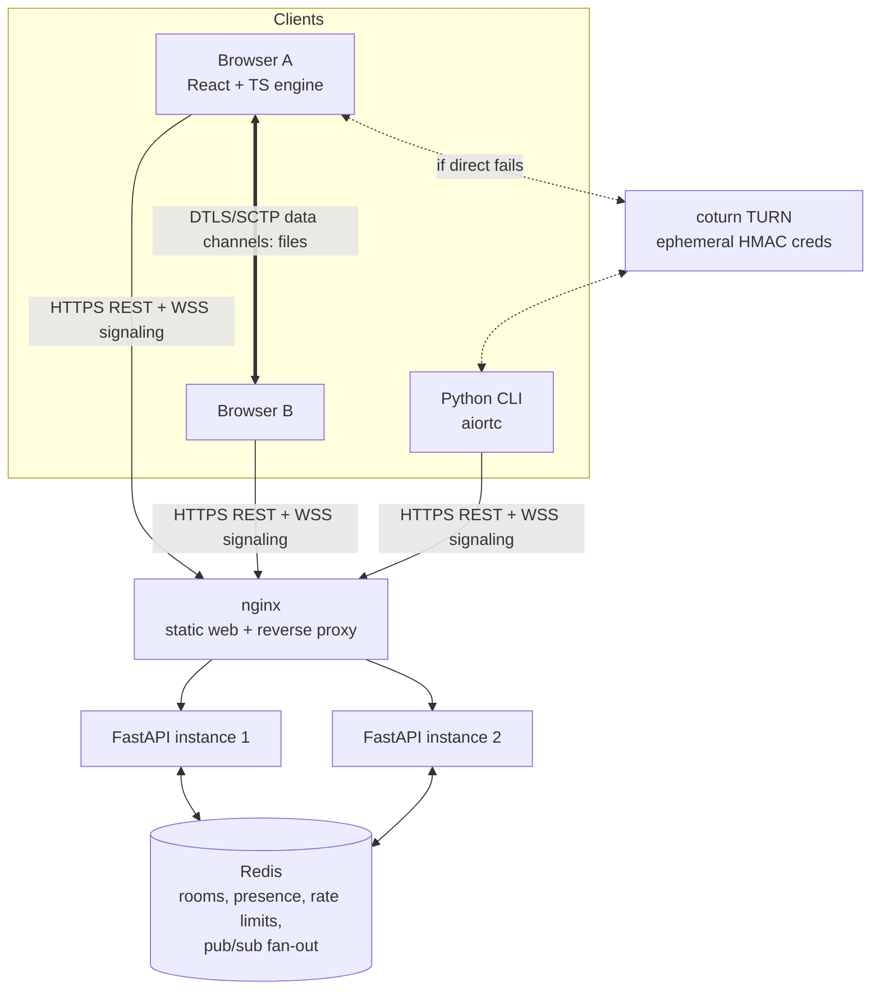

# Beam — Architecture

## 1. System overview

The server only **introduces** peers and hands out relay credentials. File bytes flow peer-to-peer: directly when
possible, otherwise through TURN, which relays DTLS-encrypted packets it cannot read.



- **nginx** serves the built web client and proxies `/api` and `/ws` to the FastAPI instances. Compose runs two
  instances to demonstrate horizontal scaling.
- **FastAPI** exposes a small REST API (rooms, ICE servers, health, metrics) and one WebSocket endpoint (`/ws`) for signaling.
- **Redis** is the only shared state: rooms and presence with TTLs, join-attempt counters, rate limits, and a pub/sub
  channel per room so a message from a peer on instance 1 reaches a peer on instance 2.
- **coturn** provides TURN (and STUN) with short-lived credentials minted by the API from a shared secret.
- **PostgreSQL** appears only with the Advanced accounts/history milestone. The MVP has no durable data and does not
  pretend otherwise (ADR-002).

## 2. Repository layout (uv workspace + web client)

```
protocol/                     # beam_protocol: shared by server and CLI
  src/beam_protocol/
    signaling.py              # Pydantic discriminated unions: client↔server messages
    peer.py                   # control-channel messages between peers
    frames.py                 # binary data-frame codec
    sas.py                    # verification-code derivation
    codes.py                  # room code format + EFF wordlist
    constants.py              # block size, frame size, limits, protocol version
  schema/                     # generated JSON Schema (source for TS types)
server/
  src/beam_server/
    main.py config.py logging.py errors.py
    api/        rooms.py ice.py health.py metrics.py
    ws/         endpoint.py session.py        # per-connection state machine
    services/   rooms.py signaling.py turn.py
    store/      redis.py rooms_repo.py presence_repo.py pubsub.py rate_limit.py
    security/   tokens.py origin.py client_ip.py
    observability/ middleware.py metrics.py
  tests/      unit/ integration/
cli/
  src/beam_cli/  main.py (Typer) signaling_client.py peer.py sender.py receiver.py storage.py ui.py
  tests/
web/                          # Vite + React + TypeScript
  src/
    engine/                   # framework-free, unit-tested
      signaling.ts peer.ts sas.ts
      transfer/ framing.ts sender.ts receiver.ts hashing.ts bitmap.ts resume.ts
      storage/  opfs-worker.ts opfs.ts
    protocol/generated.ts     # generated from protocol/schema
    state/ (Zustand stores)   ui/ pages/ components/
  tests/unit/ (Vitest)  e2e/ (Playwright)
tests/vectors/                # golden vectors shared by pytest and Vitest (frames, SAS, codes)
infra/  nginx.conf  coturn/turnserver.conf
bench/  signaling_load.py  transfer_throughput.ts  cli_throughput.py
docs/  docs/adr/
docker-compose.yml  .env.example  .github/workflows/ci.yml  .pre-commit-config.yaml
```

**The protocol is defined once.** Pydantic models in `beam_protocol` are the source of truth. The CI step
`python -m beam_protocol.export_schema` writes JSON Schema, and `json-schema-to-typescript` generates
`web/src/protocol/generated.ts`. CI fails if the generated files are stale. Binary framing and SAS derivation can't be
expressed in JSON Schema, so they are pinned by **shared golden vectors** that both the Python and TypeScript test
suites must reproduce byte for byte.

## 3. Server layering

```
api/, ws/        → transport only: parse and validate, authenticate, call a service, serialize
services/        → room lifecycle, join rules, signaling relay, TURN credential minting
store/           → every Redis command lives here (repositories + pub/sub + rate limiter)
security/        → tokens, Origin checks, trusted-proxy client IP
```

Domain errors (`RoomNotFound`, `RoomFull`, `InvalidCode`, `RoomBurned`, `RateLimited`, `ProtocolViolation`) map to an
HTTP error envelope `{"error": {"code", "message", "details", "request_id"}}` or to WebSocket close codes (see
`protocol.md`).

## 4. Key flows

### 4.1 Create, join and connect

```mermaid
sequenceDiagram
  autonumber
  participant A as Sender (A)
  participant API as FastAPI (any instance)
  participant R as Redis
  participant B as Receiver (B)
  A->>API: POST /api/v1/rooms
  API->>R: allocate nameplate (SET NX), store room + HMAC(code), TTL
  API-->>A: {room_id, code "7-otter-lantern-tiger", room_token(A)}
  A->>API: WS /ws, first msg hello{token}
  API->>R: presence A, SUBSCRIBE room:{id}
  API-->>A: welcome{peer_id, role: creator}
  Note over A,B: A shares the code or link out of band (link keeps the code in the URL #fragment)
  B->>API: POST /api/v1/rooms/join {code}
  API->>R: check attempts, compare HMAC, mark paired
  API-->>B: {room_id, room_token(B)}
  B->>API: WS hello{token}
  API-->>B: welcome{role: joiner, peers:[A]}
  API->>R: PUBLISH room:{id} peer_joined(B)
  R-->>API: (instance holding A) → A: peer_joined
  A->>API: GET /rooms/{id}/ice-servers (both peers)
  A->>B: offer / answer / ICE via signal messages relayed through Redis pub/sub
  A-->>B: DTLS handshake; data channels "control" and "data" open
  A->>B: control: hello (protocol version, capabilities)
  Note over A,B: Both display the SAS from the DTLS fingerprints and compare
```

### 4.2 Transfer

1. The sender sends `offer_files` (paths, sizes, MIME types, block size) on the **control** channel.
2. The receiver shows the preview, the user accepts, and the receiver replies `accept` with a verified-block bitmap for each file (empty on first transfer).
3. For each missing 1 MiB block: the sender reads it from disk, hashes it (SHA-256), sends `block{file, index, sha256}`
   on control, then streams the block as 64 KiB **binary frames** on the **data** channel under `bufferedAmount`
   backpressure.
4. The receiver writes frames at their offsets (OPFS in a worker, or the filesystem in the CLI). When a block is
   complete it verifies the hash, sets the bit in the persisted bitmap, and periodically sends `ack{file, bitmap-delta}`.
   A hash mismatch triggers `nack` and that block is re-sent (at most 3 times).
5. The sender sends `file_done{file, sha256}` with the file root hash (over all block hashes). The receiver compares it
   with the root computed from its own verified block hashes and marks the file verified.
6. `transfer_done` is sent when every file is verified. The receiver can then save.

### 4.3 Resume

A disconnect is detected by data channel close or ICE `failed`. The client first attempts an **ICE restart** over the
existing signaling session. If the page or socket was lost, it reconnects with its room token (valid for the room's
lifetime) and renegotiates. The receiver then re-sends `accept` with its persisted bitmap, and the sender sends only
the missing blocks. The server is not involved beyond signaling. If the *sender* reloaded, the browser has lost file
access, so the user re-selects the file. The resume is allowed only if the name and size match and the first block's
hash matches.

## 5. Scaling model

- **Web instances are stateless** apart from the WebSocket objects they hold. Each instance keeps
  `local_peers: dict[peer_id, WebSocket]`, which is inherently process-local.
- **Fan-out:** every signaling message is published to `room:{room_id}`. Each instance subscribes to the channels of
  rooms that have a local peer, and delivers only to the addressed local peer. One uniform path (always through
  Redis) is simpler and fully tested. Same-instance short-circuiting is a possible optimization, not a need.
- **Load profile:** signaling is a few dozen messages per connection setup plus heartbeats, *independent of file size*.
  TURN is the only component whose load scales with bytes, and only for relayed sessions.
- **Scale-out steps:** more API replicas (no sticky sessions needed), Redis Sentinel or managed Redis, then several
  coturn nodes with the same secret (DNS or GeoIP selection). Redis Cluster sharded pub/sub (`SSUBSCRIBE`) if one
  Redis becomes the bottleneck.
- **Failure behaviour:** if an API instance dies, its peers' WebSockets drop and the clients reconnect (possibly to
  another instance) using their tokens. Established WebRTC sessions **keep transferring**, because the server is not
  in the data path.

## 6. Engineering Q&A

1. **Why a Python backend for a WebRTC app?** The server's job is I/O-bound connection brokering: WebSockets, Redis,
   small REST calls. asyncio and FastAPI handle it well. Python also enables the aiortc CLI peer and a single shared
   protocol package. The heavy lifting (DTLS, SCTP, media) happens in the browsers. (ADR-001)
2. **Why native WebSockets instead of Socket.IO?** An explicit, versioned, schema-validated protocol that any client
   (browser, Python, curl-like tools) can speak. Socket.IO's extras (rooms, acks, reconnection) are small to implement
   and would otherwise hide the design. (ADR-001)
3. **Why Redis, and why not Postgres from day one?** All MVP state is ephemeral and TTL-shaped (rooms, presence,
   counters), and cross-instance fan-out needs pub/sub. Postgres is added only when durable data (accounts, history)
   exists. (ADR-002)
4. **How do peers on different server instances meet?** Through the per-room Redis pub/sub channel (section 5). This
   is tested with two live server instances.
5. **How are room codes protected?** Number plus 3 words from the 7,776-word EFF list (about 38.8 bits of secret).
   The code is stored only as HMAC-SHA256 with a server pepper. There are 5 failed attempts per room before it is
   burned, per-IP join rate limits, and short TTLs. (ADR-003)
6. **Why TURN, and how is it kept from being an open relay?** About 10–20% of real-world connections cannot go direct
   (symmetric NAT or restrictive firewalls, per commonly cited industry figures). Credentials are minted per room
   token, are time-limited, and are HMAC-verified by coturn. coturn denies relaying to private and loopback ranges and
   enforces quotas. (ADR-004)
7. **How do large files avoid exhausting memory?** Nothing is buffered beyond one block in flight. Receivers stream to
   the Origin Private File System from a worker using synchronous access handles (browser) or to disk (CLI). (ADR-006)
8. **How is integrity guaranteed?** Per-block SHA-256 announced before the block, verified on receipt, with retries
   on mismatch, plus a file root hash over all block hashes. A file is never marked complete with a gap. (ADR-005)
9. **How does resume work without server state?** The receiver persists the manifest and verified-block bitmap. On
   reconnect it sends the bitmap and the sender skips verified blocks. The server stays out of the data path. (ADR-005)
10. **Can the signaling server man-in-the-middle a transfer?** It could substitute SDP fingerprints. Users detect this
    by comparing the SAS derived from both DTLS fingerprints. The design also leaves an upgrade path to PAKE with the
    code's words. (ADR-009)
11. **What is measured?** Signaling relay latency and connection capacity under load (`bench/signaling_load.py`),
    transfer throughput by frame size (browser↔browser, CLI↔CLI, browser↔CLI), and memory usage during a large
    transfer. Only measured numbers go in the README.
12. **What stays out of the MVP?** Accounts and history, the encrypted relay fallback, one-to-many, mobile, LAN
    discovery. See `product.md`.
13. **What from [redacted] is not copied?** In-memory state, server-side chunk acks, header/binary message pairing, cookie
    identity, Socket.IO. See `reference-analysis.md`.

## 7. Risks and trade-offs

| Risk | Mitigation / acceptance |
|---|---|
| aiortc data-channel throughput is modest compared with browsers | Measure it and document honestly. The CLI's value is interoperability and scripting, not peak speed |
| OPFS quota and browser differences (Safari) | Feature-detect. Fall back to in-memory for small files (< 200 MB) with a clear warning. Quota checked before accept |
| Sender reload loses file access (browser security) | Re-select the file, verified by name, size and first-block hash |
| Headless-browser WebRTC in CI can be flaky | Force host candidates on localhost, disable mDNS obfuscation in tests, retry-free deterministic timeouts, trace on failure |
| TURN on localhost / Docker networking | A dev override allows the compose network in coturn. Production config denies all private ranges |
| SAS relies on users actually comparing | Displayed prominently, with an optional "confirm match" step. PAKE upgrade path documented |
| Two-instance demo is not proof of large scale | Documented as correctness under horizontal scaling. Capacity numbers come only from the benchmark |
