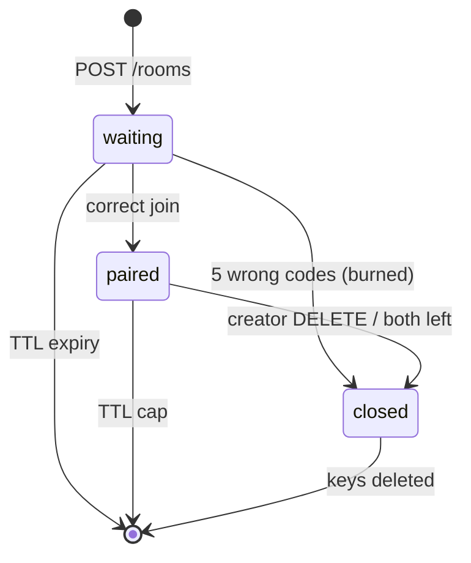
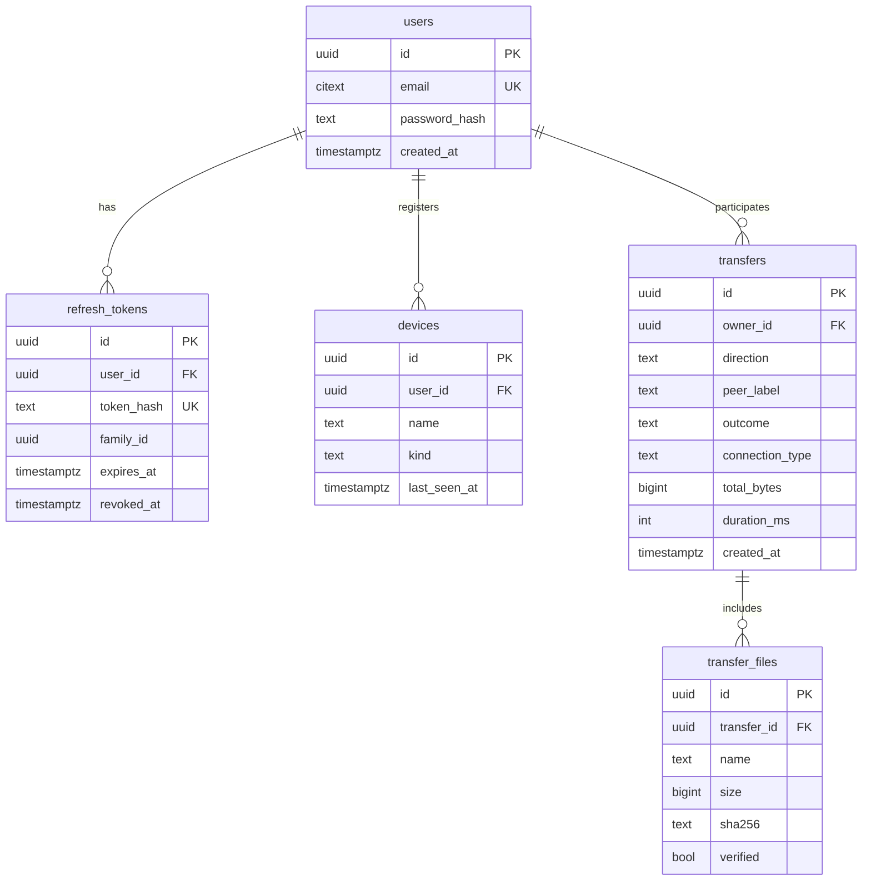

# Beam — Data Model

Beam's MVP has **no durable data**. Rooms, presence and counters are ephemeral by nature, so they live in Redis with
TTLs. PostgreSQL is introduced only by the Advanced accounts/history milestone, and that schema is specified in
section 3 so the design is complete. Rationale: ADR-002.

## 1. Redis keyspace (MVP)

All keys are prefixed `beam:` (configurable), and every key has a TTL. There are no unbounded keys.

| Key | Type | Contents | TTL |
|---|---|---|---|
| `room:{room_id}` | hash | `nameplate`, `code_hmac`, `state` (`waiting`/`paired`/`closed`), `created_at`, `expires_at`, `creator_peer`, `joiner_peer` | Waiting: 30 min. Paired: refreshed by activity, hard cap 24 h |
| `nameplate:{n}` | string | `room_id` | Same as room |
| `room:{room_id}:attempts` | string (int) | Failed join attempts. At 5 the room is **burned** (state `closed`, nameplate released) | Same as room |
| `room:{room_id}:peer:{peer_id}` | hash | `role`, `state` (`online`/`reconnecting`), `instance_id`, `last_seen` | 60 s, refreshed by the owning instance every 20 s |
| `instance:{instance_id}` | string | Heartbeat, `started_at` | 30 s, refreshed every 10 s |
| `rl:{scope}:{key}` | sorted set | Sliding-window timestamps (scopes: `create_ip`, `join_ip`, `join_nameplate`, `ice_room`) | Window length |
| channel `room:{room_id}` | pub/sub | Envelope `{to, from, msg, origin_instance, ts}` | — |

### Atomicity

- **Nameplate allocation:** `SET nameplate:{n} room_id NX EX ttl` on a random candidate from the current range, with
  retries. The range widens (999 → 9999) when a retry budget is exceeded.
- **Join:** a Lua script checks the room state, compares the attempt counter, and on success sets `state=paired` and
  `joiner_peer`, all atomically. The HMAC comparison happens in Python with `hmac.compare_digest` *before* the script.
  The script then re-checks the state, so two concurrent correct joins cannot both succeed.
- **Room close:** a script deletes the room, nameplate, attempt and peer keys and publishes `peer_left`/`room_closed`.

### Lifecycle

## 2. In-process state (per server instance)

| Structure | Purpose |
|---|---|
| `local_peers: dict[peer_id, Session]` | Live WebSocket sessions on this instance |
| `subscriptions: dict[room_id, int]` | Reference count of local peers per room; drives SUBSCRIBE/UNSUBSCRIBE on the instance's single pub/sub connection |

This state is inherently per-process (socket objects) and is rebuilt as clients reconnect. It is never the source of
truth.

## 3. PostgreSQL schema (Advanced milestone: accounts and history)

Managed by Alembic, with no `create_all`. UUIDv7 primary keys and `timestamptz`.

- **History is metadata only, and opt-in.** It is written by the *client* after a transfer (the server never sees
  file data), stored against the signed-in user, and never shared with the other peer's account.
- Constraints: `users.email` unique (citext); `refresh_tokens.token_hash` unique; `transfers(owner_id, created_at DESC)`
  index; `transfer_files(transfer_id)` index. Cascade on user deletion. `outcome` and `direction` are CHECK-constrained text.
- **Isolation:** repositories take `owner_id` and every query filters on it. Cross-user tests cover every endpoint (see testing-strategy.md).

## 4. Client-side persistence (browser)

| Store | Contents | Lifetime |
|---|---|---|
| OPFS `beam/{transfer_id}/{file_index}` | Partially received file bytes | Until the user saves or clears, or after 7 days (cleanup on app start) |
| IndexedDB `beam.transfers` | `{transfer_id, room_id, manifest, bitmaps, file digests state, updated_at}` | Same |
| sessionStorage | Room token for the current tab (for reconnect) | Tab lifetime |

The CLI keeps the equivalent state in a `.beam-partial/` directory beside the output file: a manifest JSON plus the
bitmap, written atomically via a temp file and rename.
