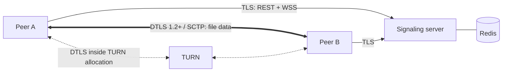

# Beam — Security and Threat Model

## Assets and security goals

| Asset | Goal |
|---|---|
| File contents | **Confidentiality and integrity end to end.** Only the two peers can read them. Neither the server nor TURN can read or alter them undetected |
| Room code | Only the intended recipient can join |
| Peer IP addresses | Revealed only to the peer (and hideable via relay-only mode, Advanced) |
| Recipient's device | Nothing is written without consent, and nothing outside the chosen directory |
| Server, TURN and Redis | Not abusable as an open relay, SSRF pivot or DoS amplifier |
| Secrets (`JWT_SECRET`, `CODE_PEPPER`, `TURN_SECRET`) | Never in images, logs or the repo |

## Trust model

- The **peers** trust each other (they chose to exchange files), but each must validate everything the other sends.
- The **signaling server** is *honest but not trusted with content*. It never receives file data. A compromised server
  could attempt an SDP-substitution MITM, which is **detectable via the SAS**.
- **TURN** sees only DTLS-encrypted SCTP. It learns metadata (IPs, volumes, timing), not contents.
- **The network** is hostile. DTLS protects data channels, and TLS protects REST/WSS in any deployment beyond localhost.

## STRIDE summary

| Threat | Example | Mitigation |
|---|---|---|
| Spoofing | Guessing a live room code; replaying another peer's token | ~38.8-bit secret words, 5-attempt burn, per-IP limits, HMAC at rest; JWT with `aud`, `exp`, pinned alg, peer-bound |
| Tampering | Server rewrites SDP (MITM); corrupted or truncated data | SAS over both DTLS fingerprints; per-block SHA-256 + file root hash |
| Repudiation | — | Structured logs of room lifecycle events (no codes, no tokens) |
| Information disclosure | Codes in logs; IP leakage; the server reading files | Code in the URL fragment; token in the first WS message, not the URL; P2P data path; relay-only mode |
| Denial of service | Room creation floods, WS message floods, huge SDP, TURN bandwidth abuse, huge manifests | Rate limits, size caps, token-bucket per connection, TURN quotas, manifest limits |
| Elevation of privilege | Path traversal writing outside the download directory (CLI); TURN relaying into the internal network | Strict path validation and safe-join; coturn `denied-peer-ip` for private ranges |

## 1. Room codes and joining

- **Secret space:** 3 words from 7,776 → 7776³ ≈ 4.7×10¹¹ (38.8 bits). The nameplate is public.
- **Online guessing is the only attack**, and it is capped: after 5 wrong attempts for a nameplate, the room is
  **burned** and both parties are told to start over. An attacker's success probability per room is therefore at most
  5 / 4.7×10¹¹ ≈ 1×10⁻¹¹. The 5-attempt cap, not the entropy, is the primary control. The entropy makes the cap cheap
  to keep low.
- **Per-IP limits:** 10 join attempts/min and 100/day. Room creation: 20/hour per IP.
- **Stored as HMAC-SHA256(pepper, room_id‖words).** A Redis dump alone does not reveal codes, and without the pepper
  the HMAC cannot be brute-forced offline. The comparison is constant-time.
- **Unknown room and wrong code return the same 404 `INVALID_CODE`**, so nameplate enumeration reveals nothing extra.
- **Share links carry the code in the fragment** (`/r#code`), which browsers do not send to servers.
- Rooms expire: 30 minutes while waiting, 24 hours at most.
- *Upgrade path (documented, not MVP):* a magic-wormhole-style **PAKE** (SPAKE2, RFC 9382) keyed by the words, with
  only the nameplate sent to the server. The server then never sees the secret, and key confirmation authenticates the
  DTLS fingerprints automatically, making the manual SAS unnecessary.

## 2. Tokens and WebSocket security

- Room tokens: HS256 JWT, 32+ byte secret (startup fails otherwise), claims `sub, room, role, aud, exp, jti`,
  algorithm pinned on decode. Tokens are bound to one room and one peer.
- The token is sent in the **first WS message** (`hello`), never in the URL. Connections without `hello` within 5 s are closed (4408).
- **Cross-site WebSocket hijacking:** the Origin header must be in `ALLOWED_ORIGINS` (4403 otherwise). Cookies are not
  used for auth at all, so CSWSH has nothing to ride on anyway.
- **Message limits:** 64 KiB per frame, SDP ≤ 32 KiB, ICE candidate ≤ 1 KiB, at most 200 candidates per session,
  token bucket of 20 msgs/s with burst 60. Pydantic `extra="forbid"`, and unknown types close with 4400.
- **Relay authorization:** the server delivers `signal` only to the *other peer in the same room*. There is no
  client-controlled addressing across rooms.
- **A peer reconnecting elsewhere replaces its older session (4409).** One live session per peer ID.
- **Client IP for rate limits** comes from `X-Forwarded-For` only when the immediate peer is a configured trusted proxy (nginx). Otherwise the socket address is used.

## 3. TURN hardening (coturn)

- `use-auth-secret` with `static-auth-secret=${TURN_SECRET}`. The API mints credentials per the TURN REST API
  convention: `username = "<expiry_unix>:<peer_id>"`, `credential = base64(HMAC-SHA1(secret, username))`. They are
  valid for 1 hour and issued only to holders of a valid room token (rate limited per room).
- **No open relay to internal networks:** `denied-peer-ip` for 0.0.0.0/8, 10/8, 100.64/10, 127/8, 169.254/16,
  172.16/12, 192.168/16, 198.18/15, 224/4, 240/4, ::1, fc00::/7, fe80::/10. Without this, an attacker holding valid
  credentials could use TURN as an **SSRF proxy** into the host network (a known class of TURN misconfiguration). The
  local-dev override allows only the compose network, and the production template does not.
- `no-multicast-peers`, `no-cli`, `no-tlsv1`, `no-tlsv1_1`, `fingerprint`, `user-quota`, `total-quota`, `max-bps`, `stale-nonce`.
- TURN TLS (`turns:` on 5349) is documented for production. Local dev uses UDP/TCP 3478.

## 4. Peer-to-peer protocol safety

- **Consent:** no bytes are written before the receiver explicitly accepts the manifest.
- **Path safety** (browser OPFS, and especially the CLI writing to the real filesystem): paths must be relative and
  normalized. `..`, absolute paths, drive letters, UNC paths, NUL and control characters, and reserved Windows names
  are rejected. The final path must resolve inside the target directory (`resolve().is_relative_to(target)`).
  Symlinks inside the target are never followed for writes. Existing files are never overwritten without `--overwrite`
  (the CLI appends ` (1)` instead).
- **Manifest limits:** ≤ 10,000 files, total size ≤ free space (checked before accept), sizes validated, block size from an allowlist.
- **Frames:** `file index` and `offset` are bounds-checked against the manifest. Out-of-range frames are dropped and
  counted, and too many close the session.
- **Integrity:** SHA-256 per 1 MiB block. Mismatch → `nack`, at most 3 retries, then `INTEGRITY_ERROR`. File root hash
  over all block hashes. The UI never shows "complete" for an unverified file.
- **XSS via file names:** React escapes by default, and `dangerouslySetInnerHTML` is banned by lint rule. File
  preview is never auto-opened. MIME types from the peer are advisory only, and downloads use `Content-Disposition`-like
  save semantics.

## 5. MITM detection (SAS)

- 40-bit SAS over `room_id` plus both DTLS fingerprints (protocol.md §4.4), shown as 5 emoji with names.
- **Why 40 bits:** an SDP-substituting attacker must find certificates whose fingerprints make both SAS values equal.
  Each attempt needs a new signed certificate, which costs at least microseconds even on fast hardware. At a
  generous 10⁶ attempts/s, 2⁴⁰ attempts take about 12 days, far longer than a transfer session. Shorter SAS values
  (24 bits ≈ 17 s at that rate) are **not** safe, which is why 4-digit PINs are rejected.
- The UI shows the SAS prominently and offers "they match / they differ". Choosing "differ" aborts and explains.

## 6. Privacy

- Browsers hide local IPs via mDNS host candidates, and server-reflexive candidates reveal the public IP to the peer.
  Relay-only mode (`iceTransportPolicy: "relay"`, Advanced) hides it.
- The server logs room IDs and peer IDs, never codes, tokens, SDP bodies, candidates or file names.
- There is no analytics or third-party script. Google's public STUN servers are replaced by our own coturn in any deployment.

## 7. Web application hardening

- CSP: `default-src 'self'; connect-src 'self' wss:; img-src 'self' data: blob:; worker-src 'self' blob:; frame-ancestors 'none'`.
- `X-Content-Type-Options: nosniff`, `Referrer-Policy: no-referrer`, HSTS in production.
- Request body limit of 16 KiB on REST (the payloads are tiny).
- Error envelope with `request_id`, and no stack traces.

## 8. Secrets and supply chain

- pydantic-settings with `SecretStr`. The app refuses default or short secrets outside `ENV=test`.
- `.env` is git-ignored, and only `.env.example` is committed. `detect-secrets` runs in pre-commit.
- Secrets are injected at runtime (compose `env_file`), never baked into images. Images run as non-root, from pinned base images.
- `uv.lock` and `package-lock.json` are committed. Dependabot covers pip, npm and Actions.
- Crypto comes from standard libraries only: `hashlib`, `hmac`, `secrets`, PyJWT, WebCrypto/hash-wasm. There is no custom
  cryptography in the MVP. (The PAKE upgrade would use RFC 9382 with its published test vectors.)

## Residual risks (accepted and documented)

- Users may skip the SAS comparison. The MVP relies on the honest-server assumption until PAKE.
- Metadata (IP addresses, transfer sizes and timing) is visible to the peer and, when relayed, to TURN.
- A malicious *peer* can send unwanted content after consent. Beam verifies integrity, not intent.
